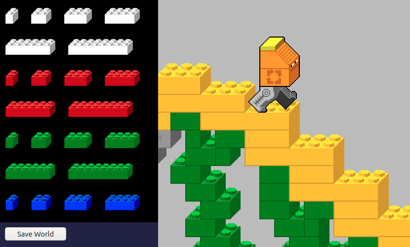

# [Janitorial Android][demo]

A partial recreation of [Junkbot][] / [Junkbot Undercover][], maybe a sequel / spinoff?
Not sure what direction this project will take.

[][demo]

[Try it out here!][demo]

Done so far:
- Brick dragging mechanics, including grabs that are ambiguous until you drag up or down, and cursors for different drags (up, down, or either)
- Junkbot's movement, generally (no momentum when in air yet; and there will probably be edge cases with different blocks)
- Level editing functionality (not present in the original games): select with mouse, select all, copy, cut, paste, delete, undo, redo, autosave, save to file, open from file, insert entities via a palette, with sound effects taken from Lego Creator
- I've started making a thing to render LDraw models into the [oblique projection][] that Junkbot uses, using [Three.js][]'s [LDrawLoader][]; you can check that out [here][3D demo]; I've put together models including Basic Bricks for comparison to the original sprites, and Junkbot and some other bots, and miscellaneous objects that might be interesting to add to the game. This will probably be useful as a pipeline for jump-starting artwork to bring new pieces into the game, but if I got it good enough, it could open the possibility of running the game in 3D... it could have like a Fez moment... but 3D probably wouldn't fit in to the gameplay mechanics nicely.

## Controls

Drag bricks with the mouse. You don't control Junkbot directly. Junkbot moves on their own.

Use the arrow keys or <kbd>WASD</kbd> (on QWERTY keyboard, something else on AZERTY), or move the mouse to the edges of screen to pan the view and look around.

<table>
	<tr>
		<td><kbd>E</kbd></td>
		<td>Toggle edit mode</td>
	</tr>
	<tr>
		<td><kbd>P</kbd> or <kbd>Spacebar</kbd></td>
		<td>Pause / unpause</td>
	</tr>
	<tr>
		<td><kbd>M</kbd></td>
		<td>Mute / unmute</td>
	</tr>
	<tr>
		<td><kbd>`</kbd></td>
		<td>Toggle debug information, including checking for collisions and other problems in the world state
		</td>
	</tr>
</table>

When in editor mode:

<table>
	<tr>
		<td><kbd>Ctrl+C</kbd></td>
		<td>Copy selected to clipboard</td>
	</tr>
	<tr>
		<td><kbd>Ctrl+X</kbd></td>
		<td>Cut selected to clipboard</td>
	</tr>
	<tr>
		<td><kbd>Ctrl+V</kbd></td>
		<td>Paste from clipboard</td>
	</tr>
	<tr>
		<td><kbd>Delete</kbd></td>
		<td>Delete selected</td>
	</tr>
	<tr>
		<td><kbd>Ctrl+Z</kbd></td>
		<td>Undo</td>
	</tr>
	<tr>
		<td><kbd>Ctrl+Shift+Z</kbd> or <kbd>Ctrl+Y</kbd></td>
		<td>Redo</td>
	</tr>
	<tr>
		<td><kbd>Ctrl+A</kbd></td>
		<td>Select all</td>
	</tr>
	<tr>
		<td><kbd>Ctrl+S</kbd></td>
		<td>Save world to a file</td>
	</tr>
	<tr>
		<td><kbd>Ctrl+O</kbd></td>
		<td>Open a saved world file</td>
	</tr>
</table>

## Credits

### Ripping resources
- Rory Fewell - [rozniak/Junkbot](https://github.com/rozniak/Junkbot)
- Sleepy Harry - [The Spriters Resource](https://www.spriters-resource.com/pc_computer/junkbot/)

### Credits for Junkbot & Junkbot Undercover

##### Art
Peter Lee / Frank Lantz

##### Code
Ranjit Bhatnagar / Peter Lee

##### Game Design
Frank Lantz / Eric Zimmerman / Nick Fortugno

##### Project Management
Peter Lee / Frank Lantz

##### Sound
Michael Sweet - Blister Media

##### Lego Producer
Tomas Clark

## Various Ideas

- Metroidvania
	- Instead of abilities like Jump (like in some Metroidvanias), you collect blocks like Jump Block, that you can then place in any level (or most levels, maybe not some levels, arbitrarily, where it would break a puzzle in an unfun way)
- Gear systems
	- Sort of like this [Lego Technic Challege game](http://biomediaproject.com/bmp/files/LEGO/gms/online/Technic/LegoMechanic/) ([video here](https://www.youtube.com/watch?v=vjevgPI6FWs))
- Machine that clones Junkbot
	- You can win as long as one Junkbot remains
- Ridable giant robots / cars?
- Liquid simulation?
- Tetris area where you need to fix machinery that pushes the bottom four rows into trucks
- Pacman area with wrapping
- Dunkbot (basketball)
- Junkbach (piano/organ something something)

## Development Setup

Requirements:
- [Git][]
- [Node.js][]
- Lack of Lego litigation (hope they're not assholes)

Steps
- [Clone the repo.][git clone]
- Open up a command prompt / terminal in the project directory.
- Install project dependencies with `npm install`
- Run `npm start` to start a web server which will reload the page automatically when you make changes

[Node.js]: https://nodejs.org/
[Git]: https://git-scm.org/
[git clone]: https://help.github.com/articles/cloning-a-repository/
[demo]: https://1j01.github.io/janitorial-android/
[3D demo]: https://1j01.github.io/janitorial-android/three
[Junkbot]: https://brickipedia.fandom.com/wiki/Junkbot
[Junkbot Undercover]: https://brickipedia.fandom.com/wiki/Junkbot_Undercover
[Three.js]: https://threejs.org/
[LDrawLoader]: https://threejs.org/examples/webgl_loader_ldraw.html
[oblique projection]: https://en.wikipedia.org/wiki/Oblique_projection
